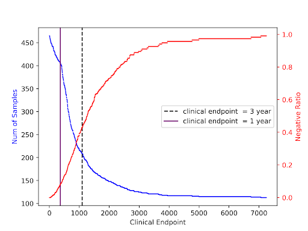
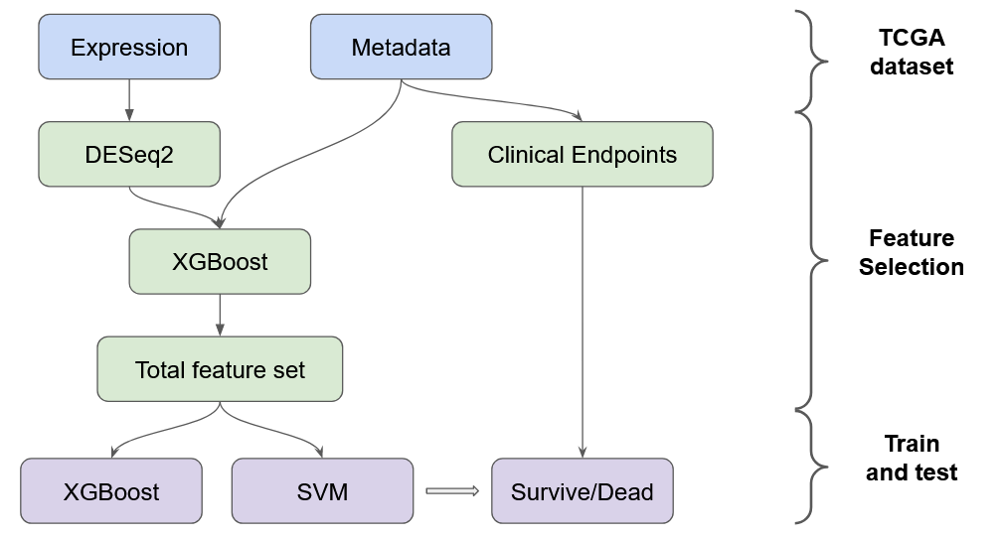
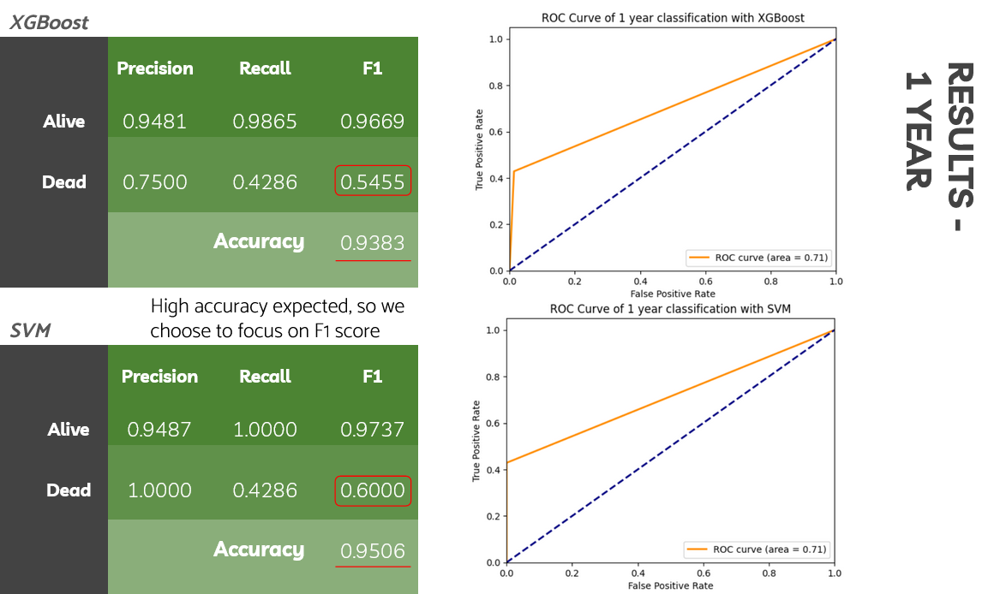
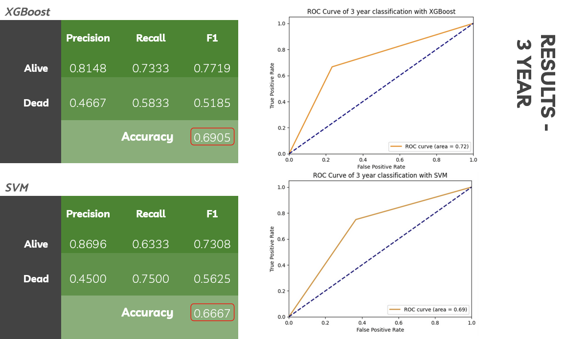

## **"How long have I got?"**

Most Stage IV lung cancer patients worldwide tend to have poor survival: 25-30% die within the first 3 months of diagnosis. However, of those patients suriving longer than 3 months, 10-15% of those patients survive very long. The question becomes then: what metrics can we use to determine a patient's survival projection using clinically relevant data. In this project, we look to develop and validate a survival prediction model in a cohort of different stages patients of lung cancer.

## Description of Files 

Data:
- **Gene_expression_log2.csv**: log2 normalized gene expression data
- **labels_1yr/3yr.csv**: labels used to predict clinical endpoints
- **metadata_final_no_os.csv**: metadata of patients 
- **top_100_DEgenes_1yr/3yr.txt**: top 100 genes from the gene expression data for the clinical endpoints, as determined by DEseq2

Scripts:

1. **DESeq2_prepreprocessing.ipynb**: Preprocessing notebook for DESeq2 analysis
2. **DESeq2.R**: DESeq2 analysis
3. **model_training_1yr/3yr.ipynb**: Feature selection using XGBoost and training/testing using XGBoost and SVM

## Data Selection 

Data for this project was taken from the Cancer Genome Atlas Lung Adenocarcinoma (TCGA-LUAD). The data consists of 572 samples obtained from 512 individuals, with over 20,000 genes for each. We mainly utilize the gene expression and metadata datasets for our analysis. We performed Log2 transformation on the expression data and removed the recurrent and normal samples. 

We look to analyze two different clinical endpoints: the 1 year and 3 year mark. We divided patients into two categories: those labeled as 'negative' if lung cancer was reported as their cause of death and their survival time was shorter than the predetermined endpoint, and 'positive' if their survival time surpassed the specified endpoint. From here, we note the 1 year dataset is incredibly imbalanced, with only ~15% of patients dying before the clinical endpoint. The 3 year dataset has a more balanced split of about 55-45%. 

## Feature Selection

We look to perform feature selection on the gene expression data. Using all 20000 genes, DESeq2 was performed to obtain the top 100 genes associated with predictions. From here, these genes as well as several metadata features (age at diagnosis, gender, tumor stage, and smoker status) were run through XGBoost to determine the most useful features.

## Training and Testing

After training our data using XGBoost, we analyzed the importance of each feature. Using a significance threshold, features above this threshold were retained for classification. Classification was performed using XGBoost as well as Support Vector Machines (SVM) using a grid search approach. Due to the imbalanced dataset, we train our models based on F1 score.

## Results

In the 1 year approach, we were able to obtain a maximal F1 score of 0.6 for the dead patient group. We note that the accuracy metric is misleading, since there are significantly more alive than dead patients.

In the 3 year approach, we were able to obtain a maximal classification accuracy of 69.05%. Since our dataset is more balanced, reporting accuracy is not as misleading as in the 1 year case.

Overall, this project successfully displays that careful feature selection using bioinformatics and classical machine learning techniques can identify prognostic features towards predicting clinical endpoint. 

## Acknowledgements

This group project was inspired by ECE 204: Statistical Learning in Bioinformatics, taught at UC San Diego under Dr. Ludmil Alexandrov.
